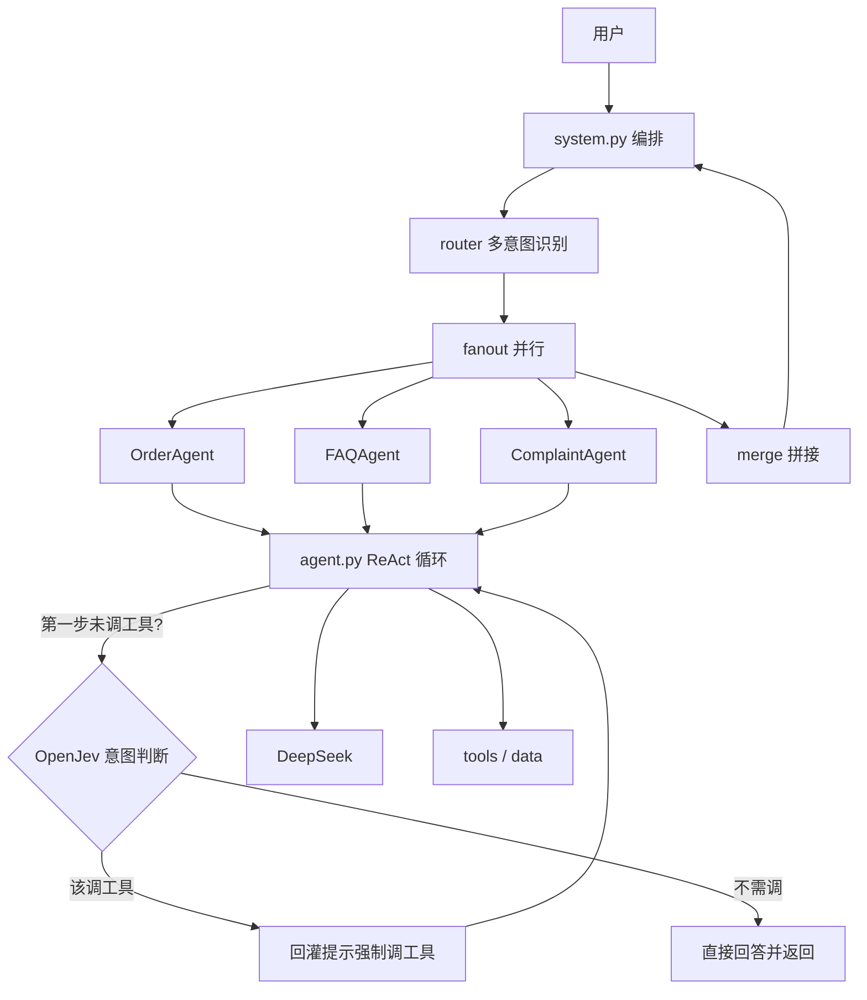

# jev-multi-agent-system

> 纯手写、**不依赖任何 Agent 框架**的 Multi-Agent 智能客服系统，并在此之上引入 **OpenJev** 作为意图判断层，显著提升"该不该调工具 / 调哪个工具"的判定准确率。

自己实现 ReAct / tool-calling 循环、工具注册、函数式 fan-out、多轮记忆——每个被 LangChain 等"藏起来"的底层机制都摊开写清楚，代码精良到能当博客逐篇读。

## 本仓库的改进

本项目在 [helloworldtang/my-multi-agent-system](https://github.com/helloworldtang/my-multi-agent-system) 基础上改造而来，核心改进是：

- 🧭 **用 OpenJev 做意图判断** — 用结构化决策模型 OpenJev（非文本生成，只返回 choice/noul 概率）接管"该不该调工具、调哪个工具"的判断。当 ReAct 第一步 LLM 没调工具时，由 `Agent.run` 内的 Jev 复核（`route_tool`）兜底；命中即回灌提示强制触发一次工具调用（见 `src/customer_service/core/jev_router.py` 与 `src/customer_service/core/agent.py`）。
- 🎯 **解决"FAQ Agent 自信跳过检索"** — 原实现 DeepSeek 在 FAQ 类问题上**觉得自己知道答案就直接回答、不调用 `search_faq`**；接入 Jev 判断层后据此强制调工具（见 `experiments/jev_system_eval.py`）。

### 正确率前后对比

同一批 40 个用例（15 订单 / 15 FAQ / 10 闲聊），期望每类调对应工具（闲聊不调工具）。

**接入前（DeepSeek 各模式意图判断）**

| 类别 | tool_calling | json_mode | prompt_fallback |
|------|-------------|-----------|-----------------|
| 订单 order | 100% (15/15) | 100% (15/15) | 100% (15/15) |
| 咨询 faq | **33% (5/15)** | **53% (8/15)** | **60% (9/15)** |
| 闲聊 chitchat | 100% (10/10) | 100% (10/10) | 100% (10/10) |
| 总计 | 75% (30/40) | 82% (33/40) | 85% (34/40) |

核心痛点：FAQ 漏判严重——DeepSeek 各模式都会"自信跳过检索"，直接凭印象回答。

**接入后（OpenJev 意图判断层复核）**

| 类别 | 接入后正确率 | 说明 |
|------|-------------|------|
| 订单 order | 100% (15/15) | 稳定 |
| 咨询 faq | **100% (15/15)** | 漏判消失 |
| 闲聊 chitchat | 100% (10/10) | 稳定 |
| 总计 | **100% (40/40)** | 目标用例全对 |

> 复现（需配置 `TYPESAFE_API_KEY`）：`uv run python experiments/jev_system_eval.py`

## 特性

- 🔧 **手写 function calling** — `@tool` 装饰器从类型注解 + docstring 反射生成 OpenAI schema，pydantic 校验参数
- 🧠 **ReAct 循环** — `max_steps` 硬上限 + 连续重复调用检测 + 工具错误回灌
- 🧭 **OpenJev 意图判断** — 该不该调工具 / 调哪个工具 / 是否多意图并行，交给结构化决策模型；ReAct 第一步未调工具时自动复核并强制触发，异常时优雅降级、不阻塞主流程
- 🔀 **函数式 fan-out** — ThreadPoolExecutor 并行多 agent，明确**否决 actor 模型**（见 design-decisions）
- 📚 **手写 TF-IDF RAG** — 零依赖 FAQ 检索，不引入向量库
- 🧪 **零网络测试** — FakeLLM 队列式 mock；`ruff` + `mypy --strict` 全绿

## 架构



详见 [docs/architecture.md](docs/architecture.md)。

## 快速开始

```bash
uv sync
cp .env.example .env   # 填入 DEEPSEEK_API_KEY 与 TYPESAFE_API_KEY
uv run customer-service          # 交互式 REPL
uv run python -m customer_service.demo   # 预设 demo
```

完整步骤见 [docs/getting-started.md](docs/getting-started.md)。

## 文档

- [架构](docs/architecture.md) — 分层与数据流
- [设计决策](docs/design-decisions.md) — 7 个取舍的 why，含否决项与诚实声明
- [DeepSeek tool calling 评测](docs/deepseek-tool-calling-eval.md) — 接入前基线

## 项目结构

```
src/customer_service/
├── core/        # 纯手写精华（llm / message / tools / agent / router / fanout / jev_router）
├── tools/       # 业务工具（order / faq / refund）
├── agents/      # 业务 Agent（core/agent 的薄封装）
├── data/        # orders.json / faq.json
├── system.py    # 编排入口：router → fanout → merge
├── cli.py       # 交互式 REPL
└── demo.py      # 预设演示
experiments/     # DeepSeek / OpenJev tool calling 探针与评测
tests/           # FakeLLM + 全量单测（不触网）
```

## 致谢

本项目改造自 [helloworldtang/my-multi-agent-system](https://github.com/helloworldtang/my-multi-agent-system)，原项目采用 MIT 协议；本次改进在保留原结构的基础上，新增 OpenJev 意图判断层。

## License

MIT